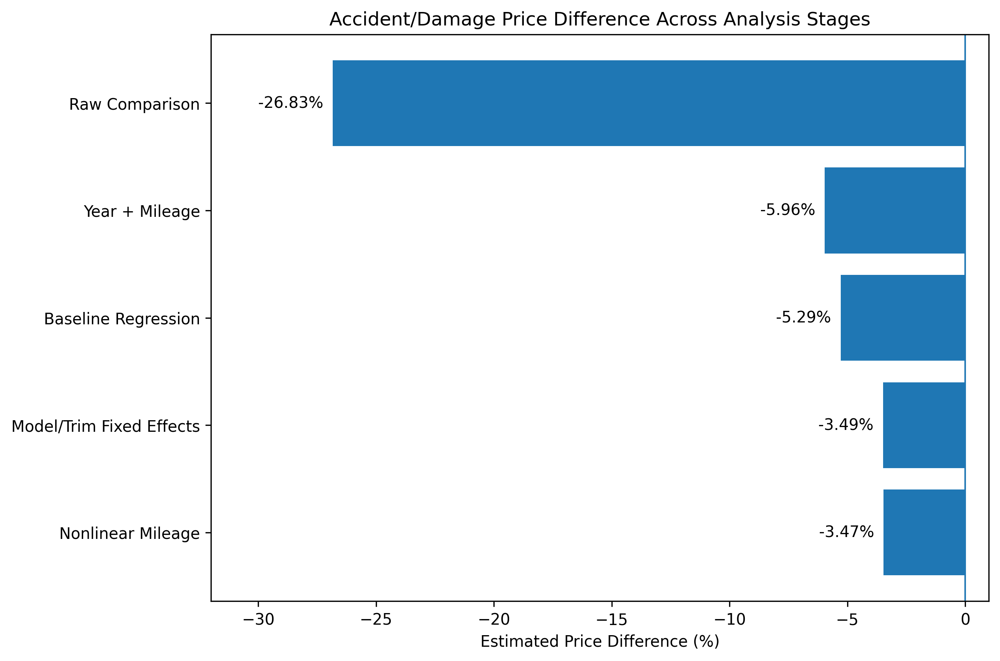
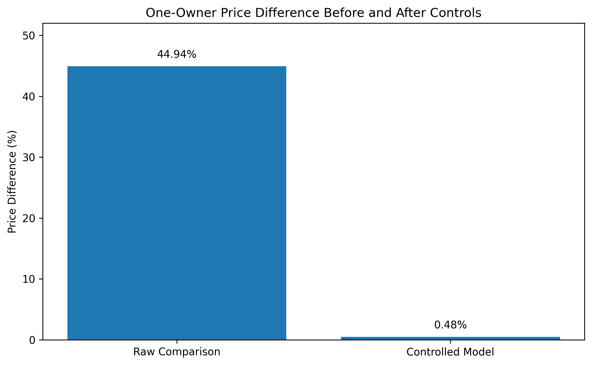

# Used-Car Pricing & Depreciation Analysis

Analysis of 762,000+ U.S. used-vehicle listings examining how accident history and ownership history are associated with listing prices.

## Project Overview

Used-car prices can differ substantially even among vehicles that appear similar. This project examines how two commonly considered vehicle characteristics — reported accident/damage history and one-owner status — are associated with listing prices after accounting for other vehicle characteristics.

I focused on two questions:

1. How is reported accident or damage history associated with vehicle listing price?
2. How is reported one-owner status associated with vehicle listing price?

The analysis uses descriptive comparisons, regression analysis, model/trim fixed effects, and robustness testing to separate raw price differences from differences associated with other vehicle characteristics.

## Key Findings

### Accident / Damage History

Vehicles with reported accident or damage history initially had median listing prices **26.83% lower** than vehicles without reported accident or damage history.

However, the two groups also differed in characteristics such as model year and mileage. After accounting for model/trim, model year, mileage, ownership and usage history, drivetrain, and fuel type, reported accident or damage history was associated with approximately **3.47% lower listing prices**.

### One-Owner Status

Vehicles reported as one-owner initially had median listing prices **44.94% higher** than vehicles not reported as one-owner.

After accounting for model/trim, model year, mileage, accident history, personal-use history, drivetrain, and fuel type, the estimated difference fell to approximately **0.48% higher listing prices**.

## Business Takeaway

The analysis shows why raw price comparisons can be misleading when evaluating used vehicles. Accident history and ownership history may provide useful information, but vehicles also differ substantially in model/trim, mileage, model year, and other characteristics.

For buyers, sellers, and dealerships, vehicle pricing should therefore be evaluated using a combination of characteristics rather than relying heavily on a single feature.

## Dataset

The analysis uses the **Used Cars Dataset** by Andrei Novikov, containing **762,091 U.S. used-vehicle listings collected in April 2023**.

The dataset was originally collected from Cars.com and is available through Kaggle:

https://www.kaggle.com/datasets/andreinovikov/used-cars-dataset

Because the dataset was collected in April 2023, the findings represent listing conditions during that period and should not be interpreted as describing the current used-car market.

Prices are listing prices rather than final transaction prices.

## Methodology

The analysis was conducted in Python using pandas, NumPy, Matplotlib, statsmodels, and Google Colab.

The workflow included:

- Data-quality and missing-value assessment
- Price filtering and exact-duplicate removal
- Descriptive price comparisons
- Model-year and mileage comparisons
- Log-price regression analysis
- Model/trim fixed effects
- Nonlinear mileage robustness testing
- Business interpretation and visualization

The original dataset contained **762,091 listings**. After restricting listing prices to $500–$250,000 and removing exact duplicate rows, **752,331 unique observations** remained before hypothesis-specific missing-data exclusions.

## Repository Contents

- `Used_Car_Pricing_Analysis_Final.ipynb` — complete analysis, methodology, visualizations, and interpretation
- `images/` — figures generated from the analysis
- `README.md` — project overview and key findings

## Limitations

This analysis uses observational listing data, so the estimated relationships should **not be interpreted as causal effects**.

The dataset does not include accident severity or number of accidents, exact number of previous owners, detailed service history, warranty information, detailed mechanical/cosmetic condition, or geographic location.

The fixed-effects analyses also exclude less common model/trim categories that did not contain enough observations from both comparison groups.

## Tools

**Python · pandas · NumPy · Matplotlib · statsmodels · Google Colab**
